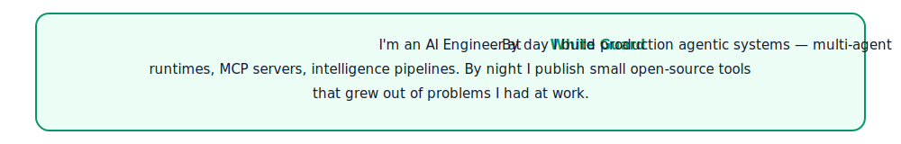
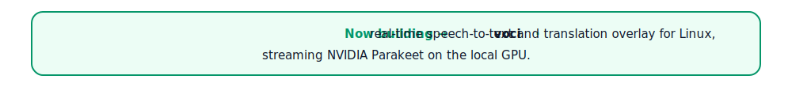
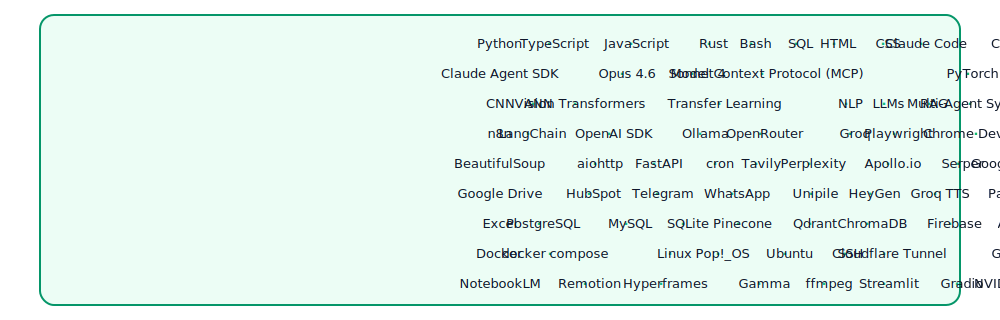

<picture>
  <source media="(prefers-color-scheme: dark)" srcset="./banner-dark.svg">
  <source media="(prefers-color-scheme: light)" srcset="./banner-light.svg">
  
</picture>

 

 

&nbsp;

&nbsp;

<picture>
  <source media="(prefers-color-scheme: dark)" srcset="./about-dark.svg">
  <source media="(prefers-color-scheme: light)" srcset="./about-light.svg">
  
</picture>

&nbsp;

<a href="https://github.com/moamen1358/voci">
<picture>
  <source media="(prefers-color-scheme: dark)" srcset="./building-dark.svg">
  <source media="(prefers-color-scheme: light)" srcset="./building-light.svg">
  
</picture>
</a>

&nbsp;

## Skills

<picture>
  <source media="(prefers-color-scheme: dark)" srcset="./skills-dark.svg">
  <source media="(prefers-color-scheme: light)" srcset="./skills-light.svg">
  
</picture>

&nbsp;

## Currently

Improving real-time multilingual subtitle quality in [voci](https://github.com/moamen1358/voci), adding presentation-context detection to [f9-talk](https://github.com/moamen1358/f9-talk), and shipping the next iteration of the partner-portal automation suite at White Guard.

&nbsp;

## Contact

[LinkedIn](https://www.linkedin.com/in/moamen-ghareeb-b4a1512b9) &nbsp;·&nbsp; [Email](mailto:moamen.ghareeb.11@gmail.com)

